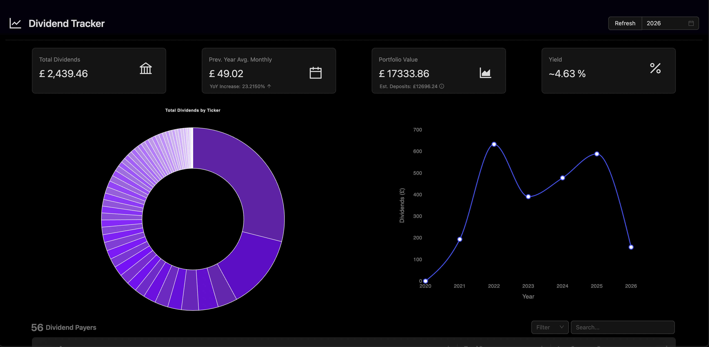
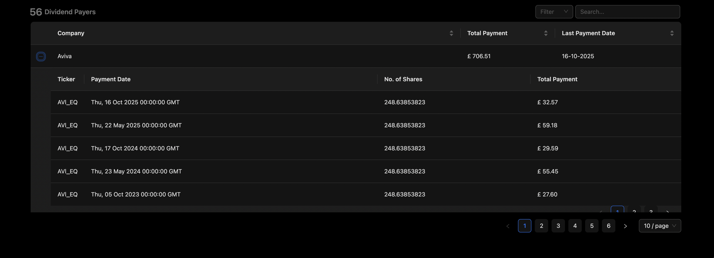

# Dividend Tracker

A full-stack web application for tracking dividend-paying stocks from Trading212 specifically, with automated data synchronization and portfolio analytics.

## Features

- **Dividend Portfolio Tracking** - Monitor your dividend-paying stocks and their performance
- **Dashboard Visualizations** - Track dividend trends with interactive charts and metrics
- **Automated Sync** - Celery background tasks keep your portfolio data up-to-date
- **Modern Tech Stack** - React + TypeScript frontend, Python Flask backend with async task processing

The Landing Page:


Dividends per Company Table


## Tech Stack

**Backend:**
- Python 3.13+
- Flask web framework
- SQLAlchemy ORM
- Celery for async tasks
- Redis message broker
- pytest & vitest for testing

**Frontend:**
- React 19
- TypeScript
- Ant Design & Material-UI components
- Chart.js for visualizations
- CSS Modules for styling

## Quick Start

### Prerequisites

- Python 3.13+
- Node.js 25+
- Redis

### Development Setup

Complete setup instructions are available in [Development Guide](./docs/DEVELOPMENT.md).

For a quick overview:

1. **Backend Setup**
   ```bash
   cd python
   python -m venv venv
   source venv/bin/activate
   make py-deps
   make run-web
   ```

2. **Frontend Setup** (new terminal)
   ```bash
   make ts-deps
   make run-fe
   ```

3. **Start Redis and Celery** (additional terminals)
   ```bash
   brew services start redis
   make run-celery-worker
   make run-celery-beat
   ```

The frontend will be available at `http://localhost:3000` and the backend at `http://localhost:5000`.

## Documentation

- **[Development Guide](./docs/DEVELOPMENT.md)** - Complete setup and development instructions
- **[Architecture](./docs/ARCHITECTURE.md)** - Project structure and technical design

## Project Structure

This is a monorepo containing both backend and frontend:

```
Dividend-Tracker/
├── python/          # Backend (Flask + Celery)
├── ts/              # Frontend (React + TypeScript)
├── docs/            # Documentation
├── makefile         # Development commands
└── requirements.txt # Python dependencies
```

## Available Commands

### Backend Commands

```bash
make py-deps           # Install Python dependencies
make run-web           # Start Flask development server
make run-celery-worker # Start Celery worker
make run-celery-beat   # Start Celery scheduler
make test-py           # Run Python tests
make test-py-cov       # Run Python tests with coverage
```

### Frontend Commands

```bash
make ts-deps          # Install npm dependencies
make run-fe           # Start React development server
```

### General Commands

```bash
make help             # Show all available commands
make freeze           # Update requirements.txt with installed packages
```

## Testing

Aiming for 100% test coverage 

### Python Tests

```bash
make test-py          # Run Python tests
make test-py-cov      # Run Python tests with coverage report
```

### Frontend Tests

```bash
cd ts                 # Run TypeScript tests
npx vitest            # Run TypeScript tests with coverage
```
